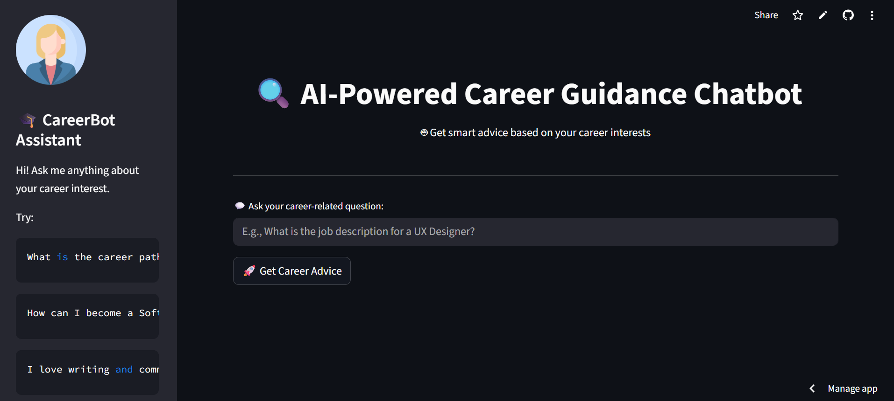
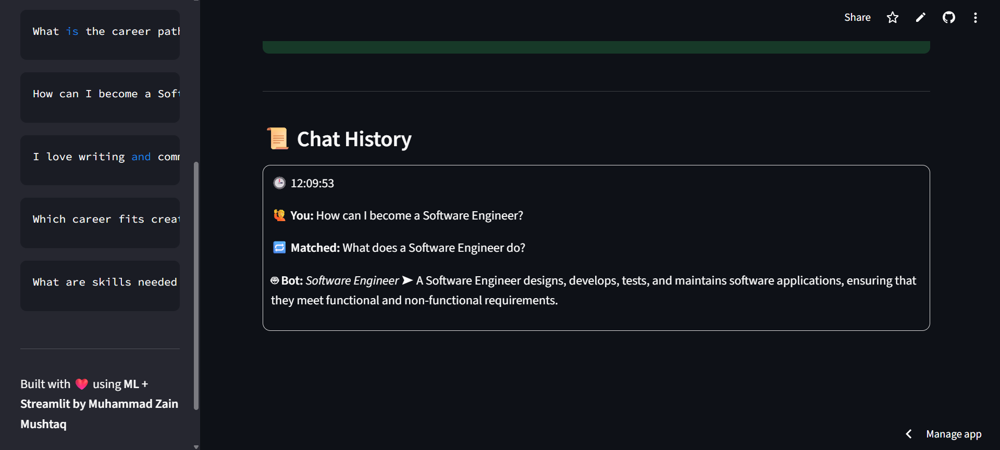

# 🎓 AI-Powered Career Chatbot

An intelligent Streamlit-based chatbot that provides career guidance based on your questions. It uses a trained machine learning model to classify your intent and return the most relevant career advice from a curated dataset.

---

## 🌟 Features

- 🤖 AI-powered career recommendation engine
- 📚 Suggests best-matching career roles
- ❓ Matches your input to the most relevant question
- 🧠 Displays detailed answers from real-world career Q&A
- 🧾 Chat history with timestamps
- ✨ Clean and modern Streamlit UI

---

## 🧠 How It Works

1. Your input question is vectorized using a **TF-IDF** vectorizer.
2. A **Logistic Regression** model predicts your career intent (role).
3. The chatbot finds the most relevant Q&A for that role using **cosine similarity**.
4. A matching answer is returned with helpful context.

---

## 📁 Project Structure

```

career_chatbot_project/
├── app.py                  # Main Streamlit app
├── vectorizer.pkl          # Saved TfidfVectorizer
├── intent_model.pkl        # Trained classification model
├── career_guidance_dataset.csv
├── UI_preview/             # Screenshots of the UI
│   ├── main.png
│   ├── input.png
│   └── history.png
├── requirements.txt
└── README.md

````

---

## 📊 Dataset Format

The dataset (`career_guidance_dataset.csv`) should contain:

| role              | question                                     | answer                                       |
|-------------------|----------------------------------------------|----------------------------------------------|
| Data Scientist    | What does a Data Scientist do?               | A Data Scientist extracts insights from data... |
| Web Developer     | What tools do web developers use?            | They use HTML, CSS, JS, frameworks...        |
| AI Engineer       | What skills are needed for AI Engineers?     | Python, Deep Learning, TensorFlow...         |

---

## 🔧 Setup Instructions

### 1. Clone the Repository

```bash
git clone https://github.com/M-Z-5474/career_chatbot_project.git
cd career_chatbot_project
````

### 2. Install Dependencies

```bash
pip install -r requirements.txt
```

### 3. Run the App

```bash
streamlit run app.py
```

---

## ✅ Requirements

All required Python packages are listed in `requirements.txt`. Install them using:

```bash
pip install -r requirements.txt
```

Content includes:

* streamlit
* scikit-learn
* pandas
* joblib

---


## 🖼️ UI Preview

### 🏠 Main Interface


### 📝 User Input Example


### 📜 Chat History Example



---


## 🙋‍♂️ Sample Questions to Try

```
What is the role of a Data Analyst?
How to become a Software Engineer?
What tools are used by a Web Developer?
I enjoy creative writing and storytelling.
Which career suits analytical thinkers?
```
## 🧑‍💻 ♂️ Author

📬 Muhammad Zain Mushtaq developed this project 

🔗 GitHub: https://github.com/M-Z-5474

📧 Email: m.zainmushtaq74@gmail.com

🔗 LinkedIn: https://www.linkedin.com/in/muhammad-zain-m-a75163358/
________________________________________
🌟 If you like this project, please consider giving it a ⭐ on GitHub!

---

